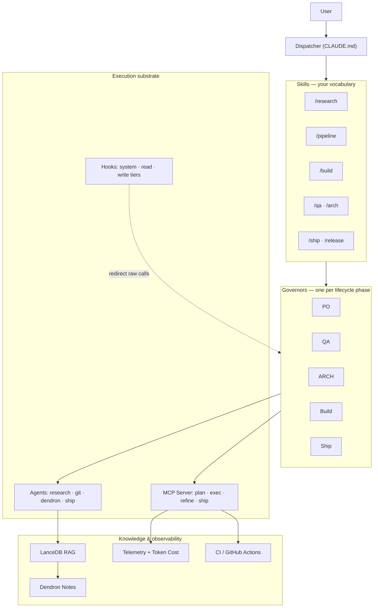

# RouteKit Shell

> **AI that follows your rules, not random impulses.**

RouteKit Shell (rks) is an opinionated framework for AI-assisted software development. It runs your AI agent inside hook-enforced lanes — story discipline, scope boundaries, branch protection, audit trails — and ships every change through a transparent build → review → ship pipeline backed by Claude Code and MCP.

If you've tried letting an AI agent loose on your codebase and ended up with mystery commits, scope creep, and "where did this come from?" reviews, rks is the response.

## TL;DR

rks is opinionated by design. Every change is **either a story** (with a plan, scope, and tests) **or a framework update** (touching rks itself, with a different boundary). If that sounds restrictive, that's the point — the discipline is the value. You see exactly what the agent will change before it changes, exactly what it cost in tokens, and exactly which guardrails were active when it ran.

## Who It's For

rks is built for the solo operator who needs to move fast:

- **Developers** building full-stack applications
- **Designers** shipping design systems and component libraries
- **Product builders** prototyping and iterating quickly
- **Founders** wearing multiple hats and getting stuff done

> 💡 **See it through your lens:** [rks for Product & Design](https://www.ux287.com/thinking/2026.07.01.rks-for-product-and-design) and [rks for Business Process Management](https://www.ux287.com/thinking/2026.07.01.rks-for-business-process-management) are value-first walkthroughs for non-engineers.

If you're a team of one (or a small team that works like one), rks gives you the structure of a mature engineering org without the overhead.

> **Want predictable AI development outcomes without implementing rks yourself?**
> [Work with UX287](https://ux287.com/) — agency engagements for teams who recognize the value but want experts to drive. Predictable LLM outcomes, opinionated workflows, agent-driven delivery.

## The Problem

AI coding assistants are powerful but unpredictable. They jump into code without context, scatter changes across files, and leave you cleaning up the mess. You spend more time reviewing AI output than actually building.

The instinct is to give the agent more freedom — let it discover, let it iterate, let it figure things out. The result is usually scope creep, mystery commits, and a lot of `git revert`.

rks goes the other direction. The agent is given **less** freedom — bounded by stories, scoped to declared file lists, gated by hooks — and in exchange you get changes you can actually review and ship.

## What "Opinionated" Means in Practice

Six concrete stances rks takes:

1. **Stories or framework.** Every change is either a story (with `targetFiles`, acceptance criteria, and tests) or a framework update (touching rks itself). If you want to "just poke around," `/po` to write a story first — it's cheap.
2. **Plan before write.** The planner generates structured edits the agent must follow. The agent doesn't free-text-edit your codebase; it executes a plan you can read.
3. **Hooks enforce, not advise.** Branch protection, scope boundaries, write provenance — these are PreToolUse hooks that block bad operations, not lints that complain after.
4. **Every off-rail session is logged.** When the agent steps outside the planner — for surgery, refactors, or framework work — the session is audited start to end and auto-shipped through a PR. Nothing escapes silently.
5. **Cost is visible.** Per-commit token spend and efficiency reports surface what the agent costs you. As rks itself improves, those reports show the curve.
6. **Two off-rail permission tiers.** `build-only` (story-scoped) is the default. `framework-update` (rks-itself-scoped) is for framework maintainers. There's no "free reign" tier — if you want one, use favorite chat agent without rks.

> 🧭 **Take the deep dive:** [*rks Agentified Workflow Deep Dive*](https://www.ux287.com/thinking/2026.02.21.rks-agentified-workflow-deep-dive) — how rks grew from tool-level orchestration into the Dispatcher → Governor → Agent tiers.

## Quick Start

### 1. Install & set up — two commands

```bash
git clone https://github.com/ux287/routekit-shell.git
code routekit-shell        # open in VS Code (or your editor)
# then, in the editor's integrated terminal:
npm install                # rks basics (npm-canonical workspaces)
npm run setup              # everything else — creates .env (asks for your key), .mcp.json,
                           # links the CLI, and builds the knowledge graph
```

That's the whole CLI story. `npm run setup` is **idempotent** and does everything a fresh
clone needs to be chat-ready: it copies `.env.example` → `.env` and prompts for your
`ANTHROPIC_API_KEY` (get one at
[console.anthropic.com](https://console.anthropic.com/settings/keys); press Enter to skip and
add it later), copies `.mcp.json.example` → `.mcp.json` (the `rks`/`rks-gov` MCP servers,
resolved via `${workspaceFolder}` — no manual edits), links the `routekit` CLI, and runs
`routekit rag init` + `rag embed` so the agent is **grounded on your very first chat** — you
never invoke RAG yourself. Prefer OpenAI? Set `OPENAI_API_KEY` in `.env` instead — the runtime
infers the provider from whichever key is present. (`.env` and `.mcp.json` are gitignored —
your keys never leave your machine.)

Then reload the window so **Claude Code** picks up the MCP servers, and open a chat.

> Rather do it by hand? `cp .env.example .env` (set `ANTHROPIC_API_KEY`) · `cp .mcp.json.example .mcp.json` · `npm run dev:link` · `routekit rag init` · `routekit rag embed`.

### 2. Initialize a Project

```bash
# Attach rks to an existing project
routekit project attach --id my-app --path ~/Projects/my-app

# Or scaffold a new one from a template
routekit project init --id my-app --stack web-vite-rag-agency --path ~/Projects/my-app
```

Which command?

- **`routekit project init`** — brand-new project: scaffolds from a stack template **and** bootstraps rks (skills, hooks, `.mcp.json`, prompts) + registers it.
- **`routekit project attach`** — existing external repo: bootstraps rks **in place** (skills, hooks, `.mcp.json`, prompts) + registers it. This is what you want for a codebase you already have.
- **`routekit project add-existing`** — registry upsert only, no bootstrap. Reserved for self-hosting rks itself, or re-registering a project that's *already* bootstrapped. Not for a first-time attach of your own repo — use `attach` for that.

Not sure which? Just open the shell in your editor and start chatting — on a fresh setup the Dispatcher asks whether you're working on rks itself or your own project and runs the right command for you.

### 3. Set Up the Knowledge Graph

```bash
cd ~/Projects/my-app
routekit rag init my-app
routekit rag embed my-app
```

### 4. Open Your Project in Claude Code

rks runs as an MCP server inside Claude Code. The first time you start a chat in a rks-enabled project:

- **Claude Code will ask permission** the first time a Governor calls an MCP tool. This is normal — Claude Code's standard user-approval gesture protects you from any agent calling tools without your knowledge. Approve once per tool to streamline future calls.
- **Run `/rks-onboard`** for a guided first-run that introduces stories, the two-tier permission system, and cost reporting end-to-end — ending with a real first PR open. Takes about ten minutes. Skip with `/rks-onboard --skip-tour` if you already know rks. See [`notes/how-to.child-project-kickoff.md`](notes/how-to.child-project-kickoff.md) for the manual setup checklist.
- **Try a slash command.** `/po "describe a small feature"` writes your first story. `/build <storyId>` builds it. You'll see governors and tools fire — every approval is yours to grant.

You're not pasting JSON into a chat. The slash commands handle MCP plumbing for you.

## The Permission Model

Two layers gate what the agent does:

1. **Claude Code's user-approval prompts.** When a Governor wants to call an MCP tool (`rks_plan`, `rks_exec`, `dendron_edit_note`, etc.), Claude Code asks you to allow it the first time. You can allow once, allow always for the project, or deny. This is the standard Claude Code model — rks doesn't bypass it.
2. **rks's hook-enforced lanes.** PreToolUse hooks check every Edit/Write/Bash call against the active scope. Out-of-scope writes are blocked. Bad branch operations are blocked. Reads without provenance are routed through the Research Agent. The hooks are the enforcement; the audit log is the receipt.

When you take the agent off-rail (`rks_guardrails_off`), you opt into a tracked window where the hooks step aside. The session is logged, the changes auto-ship via PR, and the tier — `build-only` or `framework-update` — is recorded.

## Architecture at a Glance



The Dispatcher is you-in-the-chat. Governors are subagents the Dispatcher launches for specific tasks (write a story, build a story, ship a commit). MCP tools are the operations Governors call. Hooks are PreToolUse guards enforced by the surrounding system — even if a Governor tries to do the wrong thing, the hooks stop it.

State machines define which tools each Governor can call in each state — chain-violation errors fire when Governors stray outside their lane.

Behind the Governors and MCP tools is a **per-project RAG index plus Knowledge Graph**. The RAG indexes your `notes/` (Dendron-flavored), code, and docs into a vector store. The Knowledge Graph holds structured project metadata — stories, dependencies, file relationships, ownership. When the Research Agent or refine/plan steps need context, they query the RAG and KG instead of loading entire files into the chat. The agent stays grounded in your project; your context window stays lean.

> 📐 **Take the deep dive:** [*RouteKit Shell — The Current Architecture*](https://www.ux287.com/thinking/2026.06.30.rks-current-architecture) walks the full tier stack, the story lifecycle state machine, and the redirect hooks in depth.

## Cost & Efficiency Visibility

rks doesn't just tell you what the agent did. It tells you what it cost.

Every Governor session, every plan attempt, every refine cycle, every exec retry has its token spend recorded. Per-commit reports surface the raw cost AND a `wasteRatio` — what fraction of spend produced shipped output vs. what was burned on retries, failed plans, or reverted commits. Same successful build, single-shot vs three retries: identical raw cost, very different efficiency.

**RAG + KG are the efficiency lever rks leans on hardest.** Instead of loading entire files into context for every reasoning step, the agent queries a per-project vector index and pulls only the chunks it needs. Embeddings cost a tiny fraction of inference — embedding your project once and querying many times is dramatically cheaper than re-feeding files into the chat for every story. The Knowledge Graph compounds the savings: structured project metadata (stories, dependencies, ownership) is read directly without LLM round-trips. Cost reports surface the cache-hit and retrieval-vs-context ratios so you can tune your RAG configuration for your project's shape.

As rks itself evolves — better prompts, sharper state machines, smarter refine loops — that waste ratio drops. The reports show the curve.

The token-economy design — embeddings vs. inference, cache-hit ratios, retrieval-vs-context — is covered in the deep-dive blog series at [ux287.com/thinking](https://www.ux287.com/thinking).

## Honest Limitations

- **rks requires Claude Code.** The Dispatcher runs as a Claude Code chat session; MCP tooling depends on Claude Code's MCP support. Support for Codex and Github Copilot coming soon.
- **rks is opinionated.** rks runs agents inside governed lanes — stories, scopes, hooks, audit trails. Today the focus is software development; the underlying framework applies to any domain where agent discipline, structured provenance, and cost visibility matter.
- **rks is 0.x.** Breaking changes are expected. The core flow has been stable for months, but APIs and config schemas evolve. Pin to a tag if you need a stable target.
- **rks has been used in dogfood-shaped projects.** Solo builds, small teams, opinionated workflows. It hasn't been battle-tested at multi-team-multi-repo scale; that's the RKS Pro story.

## Releases Are Snapshots

rks moves fast. **Every release is a snapshot in time** — you get whatever version of the shell you clone, and that's the deal. There's no auto-upgrade of your rks clone; pin to a tag for stability, or fork it and make it your own.

Your *child projects* are the part that stays current, deliberately: `routekit project upgrade --id <id>` reconciles a project's rks scaffolding (hooks, prompts, skills, MCP wiring) to whatever shell version you're on — patch and minor jumps today, major jumps gated until there's a migration path. Move the shell forward, then bring your projects along on your terms.

The one thing *not* to do is wire something to our release cadence or assume today's APIs survive to next week — leaning on upstream rks as a stable dependency is, honestly, a bit Wild West right now, by design. Think **playground with guardrails**, not a product with an SLA. If "move fast, own your copy" is the trade you want, you're in the right place. If you need something supported and upgrade-managed, that's the [RKS Pro](#rks-pro) conversation.

## Status & Maturity

- **Stable**: the Governor flow (PO → QA → Build → Ship → Release), the off-rail session model, the hook enforcement layer, the MCP tool catalog, and the public-snapshot publish workflow.
- **Evolving**: the permission tier model (recently shipped two-tier), the cost reporting (V1 design landing soon), and the `/rks-onboard` guided first-run.
- **Forthcoming**: the observability dashboard, Codex / GitHub Copilot support, and the hosted multi-project knowledge graph (RKS Pro).

Track the [release notes](https://github.com/ux287/routekit-shell/releases) for what's shipped.

## Learn More

The thinking behind rks lives in the **deep-dive blog series** at [ux287.com/thinking](https://www.ux287.com/thinking):

- [**What Is rks? — The Current Architecture**](https://www.ux287.com/thinking/2026.06.30.rks-current-architecture) — the present-tense tour: the Dispatcher → Governor → Agent tiers, the skill vocabulary, the story lifecycle, redirect hooks, CI + cost observability, and RAG grounding
- [**rks Workflow Deep Dive**](https://www.ux287.com/thinking/2026.01.22.rks-workflow-deep-dive) — the Detect → Plan → Validate → Apply core, and why guardrails beat freedom
- [**rks Agentified Workflow Deep Dive**](https://www.ux287.com/thinking/2026.02.21.rks-agentified-workflow-deep-dive) — the multi-tier agent architecture and the PO → QA → Build pipeline
- [**rks for Product & Design**](https://www.ux287.com/thinking/2026.07.01.rks-for-product-and-design) — governed *thinking*, not just governed code: the PO step, research, and design tooling
- [**rks for Business Process Management**](https://www.ux287.com/thinking/2026.07.01.rks-for-business-process-management) — AI-First BPM: a governed agent acting on your business's own knowledge graph
- *Trust Deep Dive* and *Public Launch Deep Dive* — *forthcoming*

The docs that ship with the repo live in the `notes/` vault — start with [`notes/how-to.child-project-kickoff.md`](notes/how-to.child-project-kickoff.md) for the manual setup checklist, then browse the `how-to.*` and `canon.*` namespaces.

## Project Structure

```
routekit-shell/
├── packages/
│   ├── cli/              # CLI commands
│   ├── design/           # Shared design system
│   └── mcp-rks/          # MCP server (planning, execution, RAG)
├── templates/            # Project templates
├── notes/                # Documentation (Dendron)
├── .rks/                 # Project state (project.json, telemetry, runs)
├── .routekit/            # Hooks
└── scripts/              # Utilities
```

## RKS Pro

rks (MIT) is fully featured for solo developers and small teams.

**RKS Pro** is for teams that need:

- Multi-developer coordination with centralized orchestration
- Hosted knowledge graph with multi-project embeddings
- Git traffic cop for concurrent AI agents
- Enterprise deployment (self-hosted or managed)

RKS Pro inverts the architecture: instead of agents driving with hook enforcement, RKS orchestrates the agents. [Learn more →](https://ux287.com/routekit)

## Development

```bash
npm test                    # Run all tests
npm run test:smoke          # Smoke tests
npx vitest run              # Unit tests
npm run dev:link            # Link CLI locally
```

## Contributing

We use rks to build rks:

1. Write a backlog story (`/po`)
2. QA it (`/qa <storyId>`)
3. Build it (`/build <storyId>` for application code; off-rail for framework code)
4. Ship it (auto-ships through `rks_guardrails_on` for off-rail; `/ship` otherwise)
5. Release it (`/release` from staging)

The contributing flow is documented in [`CLAUDE.md`](CLAUDE.md) and in the deep-dive blog series.

## License

**GNU AGPL-3.0-or-later** — see [LICENSE](LICENSE). Use it, study it, modify it, share it. The one catch: if you run a *modified* rks as a network service, the AGPL asks you to make your changes available to its users. Want to build on rks commercially without the copyleft terms? That's the [RKS Pro](#rks-pro) conversation.

---

**Ready to bound your AI agent so you can actually trust it?**

```bash
npm run dev:link && routekit --help
```
